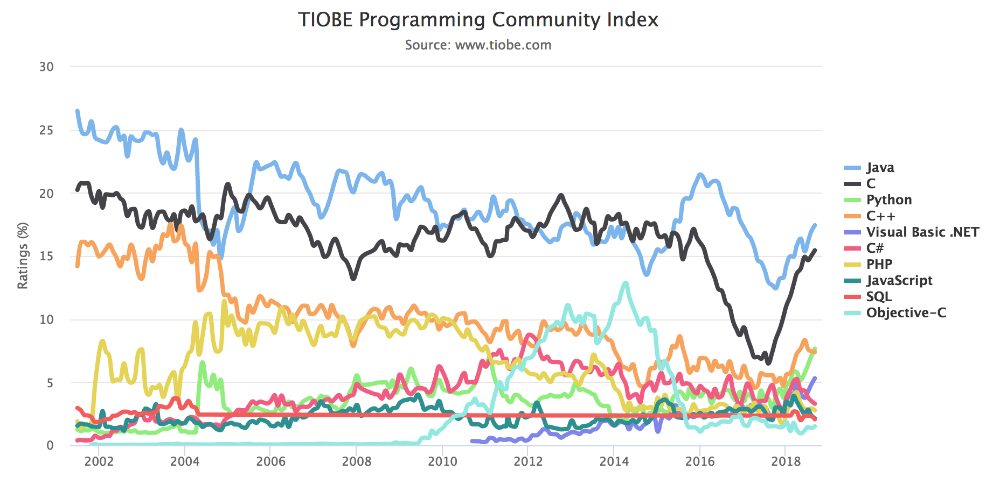

### Introduction

 <!-- .element: class="stretch" style="max-width: 70%;" -->

[Merge sort sur Rosetta Code](http://rosettacode.org/wiki/Sorting_algorithms/Merge_sort)

Ceci n'est pas un cours de Python <!-- .element: class="strong" -->

Note:
- Variété des langages de programmation
- Variété des syntaxes
- ????? Variété des styles
- La reussite dépend plus des bibliothèques et/ou main mise sur une niche

--

### Caractéristiques de python

- Langage interprété (même s'il compile)
- Typage dynamique
- *Duck typing*
- language objet à classe et héritage multiple
- Haut niveau
- Gestion de la mémoire implicite (GC)

Note:
Pour le C / pas de surcoût à l’exécution
il ne fait rien d’autre que ce que vous lui dites!

--

### Chaine de compilation

Édition
Compilation
Exécution

 <!-- .element: class="stretch" style="max-width: 70%;" -->

Note:
Tout n'est pas incompatible ... cf java/python/...

--

### S'il vous plaît

- Utilisez un VRAI éditeur de texte (emacs, vim, atom, ...)
- Mettez de la couleur
- Utilisez l’indentation automatique
- Restez cohérent
- Utilisez des noms évocateurs \
  plus c'est global plus c'est long.
- Testez régulièrement
- Commentez (et en anglais c’est mieux !)

> Pour Python: [PEP 8](https://www.python.org/dev/peps/pep-0008)

Note:
extrait de mon cours

--

### Aide

Parler de la doc
de stackoverflow
et de comment-ca-marche, le doctisimmo de l'info

### Conseil

> Remplacez le copier/coller par le couper/coller
